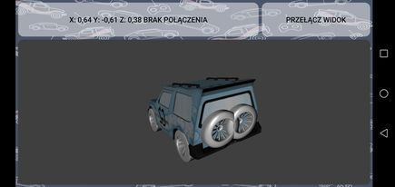

# STM32CAR

Little toy car base on STM32 NUCLEO F103RB driven by mobile app using accelerometer.

## Technologies

* Xamarin Forms
* UrhoSharp Library
* ACR Reactive BluetoothLE Plugin
* STM32 Nucleo F103RB (but its easy to use with other board)

## How does it work

* App take data from accelerometer or simple buttons view
* In case of accelerometer Z axis is responsible for moving forward/backward and Y axis for moving left/right
* Data are sent using Bluetooth
* Nucleo board recieve data using HM-10 module
* Flecher's checksum is used
* Nucleo board generate PWM on two channels
* In project we used H-bridge
* Everything is powerd by powerbank 

## Gallery

## 3D Model By
https://github.com/WerPla
